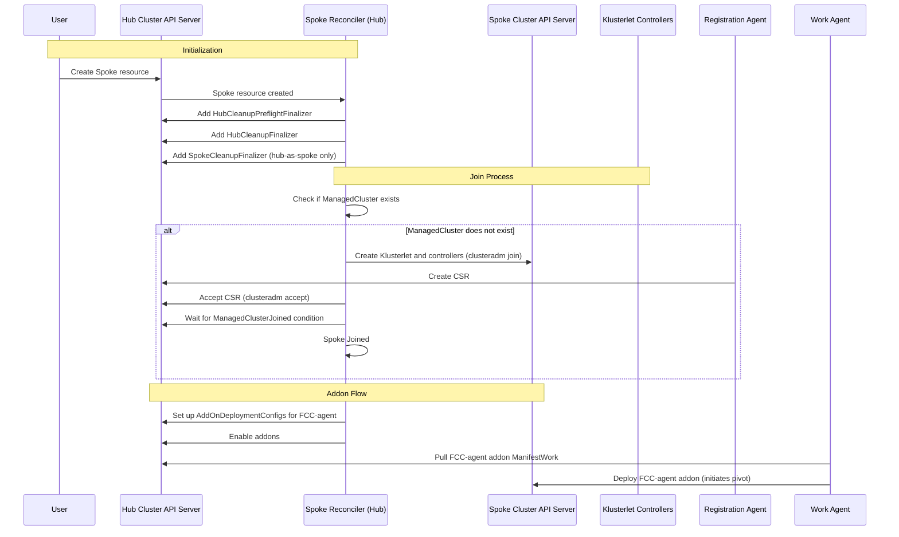
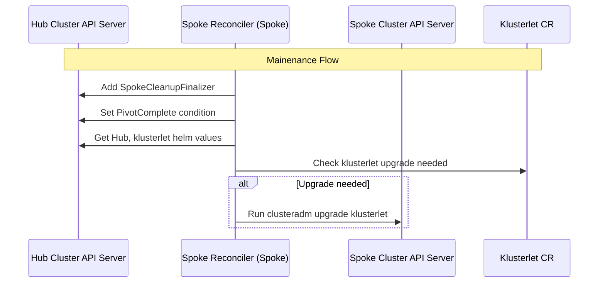
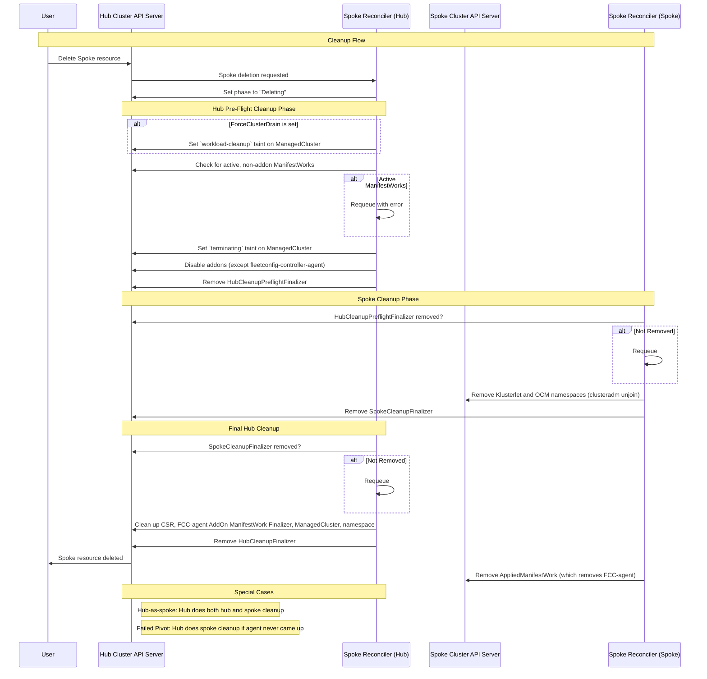
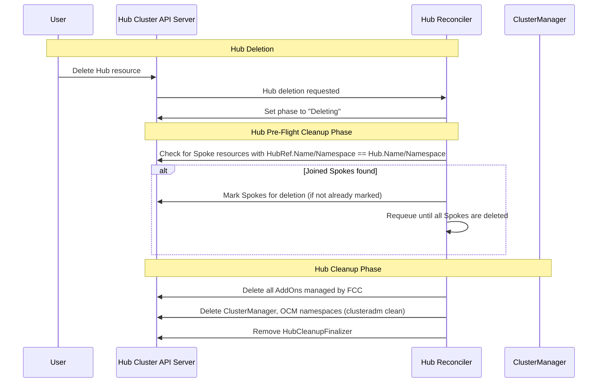

# Spoke Reconciler Walkthrough

For the purposes of this document, `Spoke Reconciler (Spoke)` refers to the `SpokeReconciler` running on the spoke cluster, and `Spoke Reconciler (Hub)` refers to the `SpokeReconciler` running on the hub cluster. This is different from the `HubReconciler`, which is a hub-only controller for reconciling the Hub resource.

The Spoke reconciler runs in two different modes depending on where it's deployed:

- **Hub mode**: Runs on a hub cluster, handles joining spokes and cleaning up hub resources
- **Spoke mode**: Runs on spoke clusters, handles klusterlet upgrades and local cleanup. Automatically installed as an [OCM addon](https://open-cluster-management.io/docs/concepts/add-on-extensibility/addon/) when a spoke is joined to a hub.

Note: *hub-as-spoke* clusters are a special case where the hub is registered as a spoke. A hub-as-spoke cluster is denoted by either the name `hub-as-spoke` or an InCluster kubeconfig.

## Reconciler Steps

### 1. Finalizer Setup

When a Spoke resource is created, the reconcilers add finalizers to control cleanup:

**Spoke Reconciler (Hub)** adds:
- `HubCleanupPreflightFinalizer` - removed when hub is ready for spoke to unjoin
- `HubCleanupFinalizer` - removed after hub finishes cleanup
- `SpokeCleanupFinalizer` - only for *hub-as-spoke* clusters

**Spoke Reconciler (Spoke)** adds:
- `SpokeCleanupFinalizer` - removed after spoke finishes local cleanup

### 2. Day 1 Operations

**Spoke Reconciler (Hub)**:
1. Check if spoke is already joined as a ManagedCluster
2. If not joined: run `clusteradm join` on the spoke, then `clusteradm accept` on the hub
3. Wait for ManagedClusterJoined condition
4. Set up addon deployment configs and enable addons
5. For hub-as-spoke: also do [day 2 operations](#3-day-2-operations)

### 3. Day 2 Operations

**Spoke Reconciler (Spoke)**:
1. Set PivotComplete condition (spoke agent is now managing itself)
2. Check if klusterlet needs upgrading by comparing config hash and bundle version
3. If upgrade needed: run `clusteradm upgrade klusterlet`

### 4. Cleanup Process

The cleanup process coordinates between hub and Spoke Reconciler (Spoke)s using finalizers.

**Spoke Reconciler (Hub)**:
1. Check for active ManifestWorks (can't cleanup if cluster is still in use)
2. Disable addons (but keep fleetconfig-controller-agent running so spoke can unjoin)
3. Remove `HubCleanupPreflightFinalizer` (signals spoke to start unjoin)

**Spoke Reconciler (Spoke)**:
1. Wait for hub to remove `HubCleanupPreflightFinalizer`
2. Run `clusteradm unjoin` to deregister from hub
3. Remove klusterlet and OCM namespaces
4. Remove `SpokeCleanupFinalizer` (signals hub that unjoin is done)
5. Clean up remaining AppliedManifestWorks (at this point, there is only 1 - the fleetconfig-controller-agent)

**Spoke Reconciler (Hub)**:
1. Wait for spoke to remove `SpokeCleanupFinalizer`
2. Clean up remaining AppliedManifestWorks (at this point, there is only 1 - the fleetconfig-controller-agent)
3. Remove `HubCleanupFinalizer`

In total, the cleanup process is completed in 3 reconciles - 2 on the hub and 1 on the spoke.

**Special Cases**:

There are 2 special cases to consider:

- **hub-as-spoke**: The Spoke Reconciler (Hub) will also run the spoke-side cleanup steps right after the hub pre-flight cleanup steps. Cleanup completes in 2 reconciles.
- **Failed Pivot**: The spoke agent never came up, so the hub will attempt the spoke-side cleanup steps right after the hub pre-flight cleanup steps. Cleanup completes in 2 reconciles.
This allows for an "escape hatch" if the spoke agent never came up. This is the only case where a hub will perform day 2 operations on a spoke. It will never attempt upgrades on a spoke.

## Key Points

- All configuration is done on the hub cluster by CRUD operation on Spoke resources.
- After the initial join, OCM addon framework is leveraged to install a fleetconfig-controller-agent inside the spoke cluster. The agent is responsible for the spoke's day 2 operations, including klusterlet upgrades and local cleanup.
- After the "pivot", the spoke kubeconfig secret can be safely deleted. The hub will no longer directly manage the spoke cluster. Instead, the agent will asynchronously pull updates from the hub and reconcile them locally.
- Leveraging finalizers to coordinate cleanup tasks allows the controllers to operate independently and avoid direct communication. Otherwise, API calls between the manager and agent would be required to coordinate cleanup.

## Sequence Diagrams

### Spoke Reconciles

#### Actors:
- User: End user
- HubK8s: Hub cluster Kubernetes API server
- Spoke Reconciler (Hub): Hub-side instance of the fleetconfig-controller-manager SpokeReconciler
- SpokeK8s: Spoke cluster Kubernetes API server
- Spoke Reconciler (Spoke): Spoke-side instance of the fleetconfig-controller-agent SpokeReconciler
- Klusterlet CR: Klusterlet resource in the spoke cluster
- RegAgent: OCM Klusterlet Registration Agent
- WorkAgent: OCM Klusterlet Work Agent

#### Day 1 - Join

#### Day 2 - Maintenance

#### Day 2 - Cleanup

### Hub Deletion

#### Actors:
- User: End user
- HubK8s: Hub cluster Kubernetes API server
- Hub Reconciler: Controller responsible for reconciling the Hub resource
- ClusterManager: ClusterManager CR and related controllers installed on the hub cluster

#### Cleanup Flow
